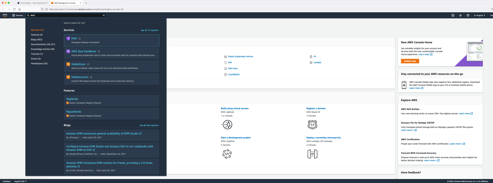
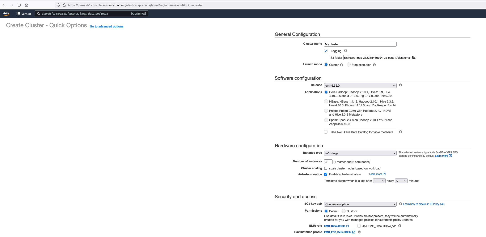
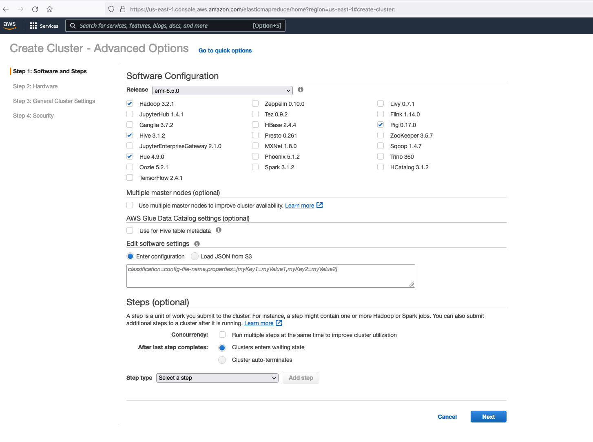
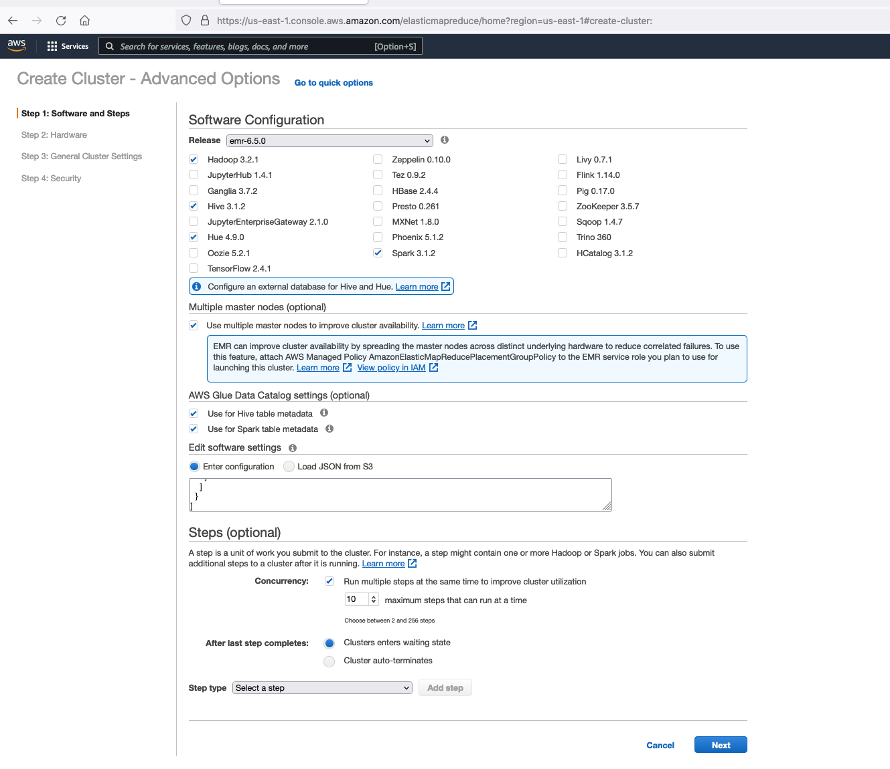
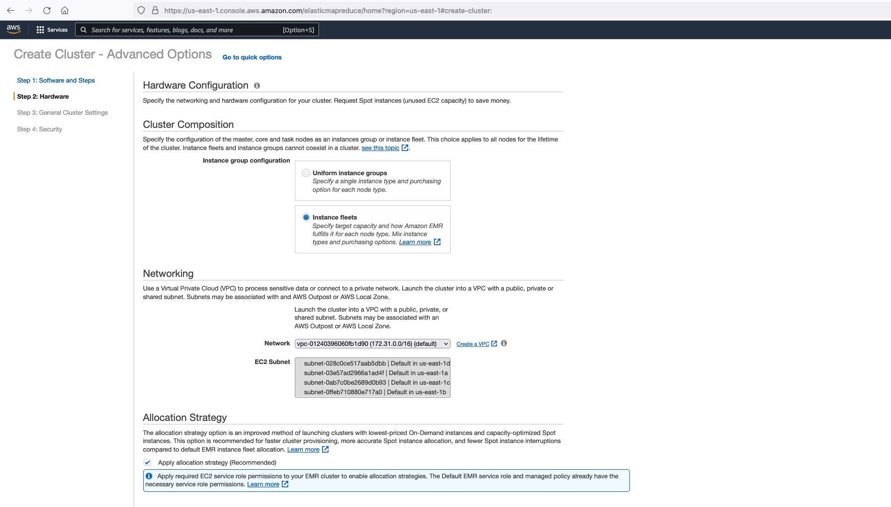
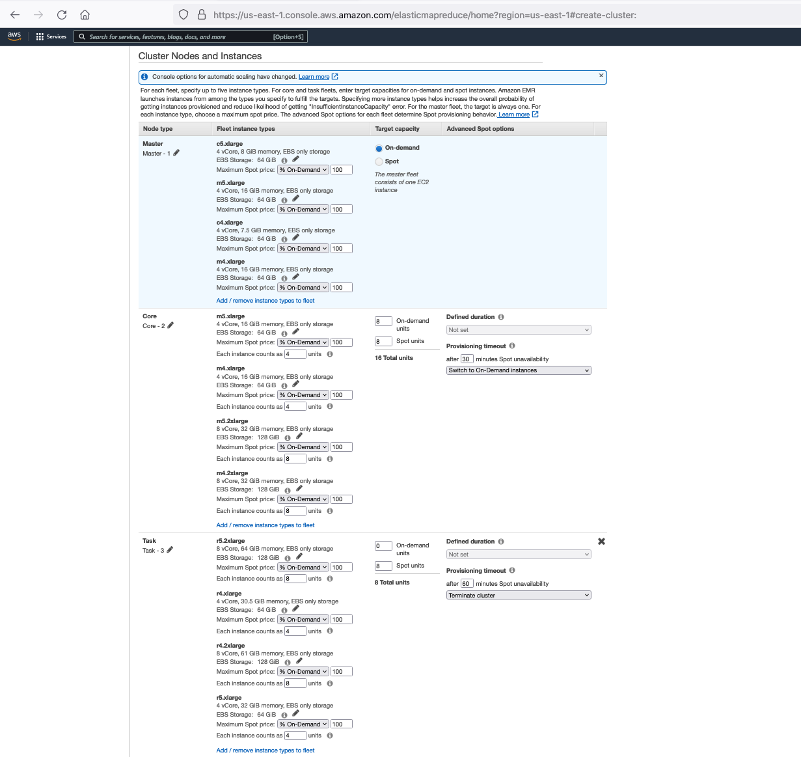
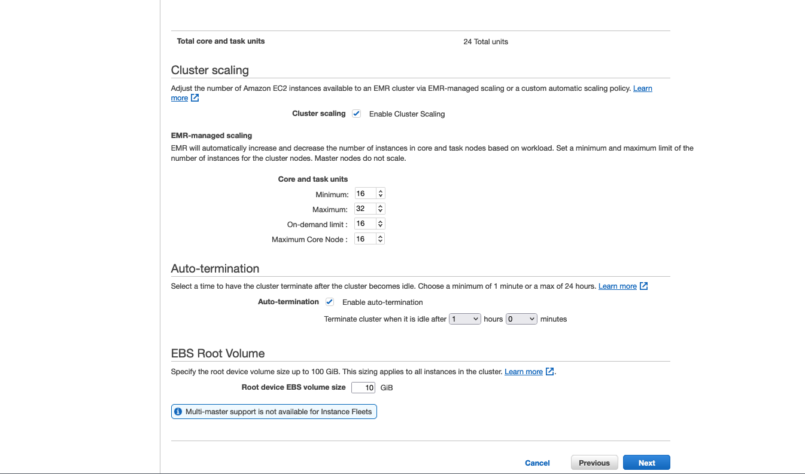
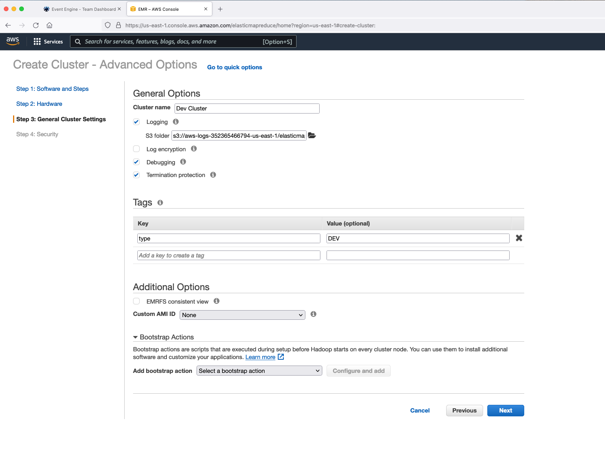
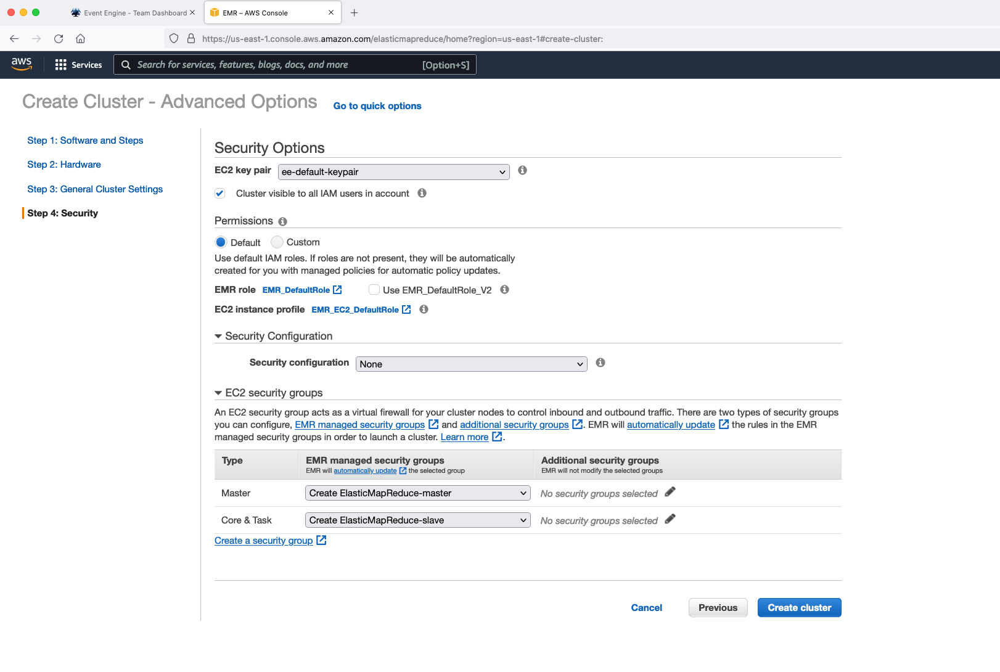

# ** Exercise 1 – Launching an EMR cluster (30 mins)  **

This exercise is meant to show you different options and features available while trying to create an EMR cluster. EMR clusters required are already created in your event engine accounts which we will use for our exercises.

### Create EMR Cluster with Instance Fleets
Go to the EMR Web Console from AWS Management Console

Click on “Create cluster”

Click on “Go to advanced options”

Explore the options on all 4 Steps.

#### Step 1: Software and Steps
* Choose latest release label: EMR 6.5.0.
* Look at the applications available. Choose Spark, Hive and Hue for example.
* You can choose Use multiple master nodes to improve cluster availability which will launch 3 X EMR Leader Nodes.
* You can use AWS Glue Data Catalog for Hive and Spark tables.
* Under Software Configurations, you can provide a JSON config to override default values. For example, you can use below JSON:
```
[{
		"Classification": "spark",
		"Properties": {
			"maximizeResourceAllocation": "true"
		}
	},
	{
		"classification": "hive-site",
		"properties": {
			"hive.blobstore.use.output-committer": "true"
		}
	},
	{
		"Classification": "hadoop-env",
		"Properties": {

		},
		"Configurations": [{
			"Classification": "export",
			"Properties": {
				"HADOOP_DATANODE_HEAPSIZE": "2048",
				"HADOOP_NAMENODE_OPTS": "-XX:GCTimeRatio=19"
			},
			"Configurations": [

			]
		}]
	}
]
```
* Select "Run multiple steps at the same time to improve cluster utilization". You can change the step concurrency as well which is defaulted to 10. You can submit a Spark step during cluster creation. But for now, we can leave it as is. We can also submit steps to a running EMR cluster.
* For transient or short-lived EMR clusters, you can add steps during cluster creation and choose to auto-terminate your clusters after last step completion using option "Cluster auto-terminates". For now, we can leave it at default "Clusters enters waiting state".
* Click on Next. 
#### Step 2: Hardware
* There are two types of Cluster Compositions: Uniform instance groups and Instance fleets. Uniform instance groups will allow you to provision only one instance type within a single node group. Also, this option will only look at a single subnet while provisioning clusters. Let's choose instance fleets which provide us more flexibility in terms of hardware configuration.
* Under Networking, leave it at default VPC and choose all the 6 EC2 subnets in that VPC.
* Allocation strategy option is an improved method of launching clusters with lowest-priced On-Demand instances and capacity-optimized Spot instances. This option is recommended for faster cluster provisioning, more accurate Spot instance allocation, and fewer Spot instance interruptions compared to default EMR instance fleet allocation. Select "Apply allocation strategy". 
* Under Cluster Nodes and Instances, for leader node type, click on "Add / remove instance types to fleet" and choose m5.xlarge, m4.xlarge, c5.xlarge, c4.xlarge. Choose on-demand. For core node type, choose 8 on-demand units and 8 spot units and select m5.xlarge, m5.2xlarge, m4.xlarge, m4.2xlarge. Under Provisioning timeout
after x minutes Spot unavailability, choose 30 mins and then "Switch to On-Demand instances". For task node type, choose 8 spot units and select r5.xlarge, r5.2xlarge, r4.xlarge, r4.2xlarge. You can choose up to 30 different instance types for each node type. 
* Click on "Enable cluster scaling" and choose core and task units. Choose minimum=16, maximum=32, on-demand limit=16, maximum core node=16. You can also enable scaling  after the cluster has been launched.
* Enabling auto-termination helps you save cost by terminating idle clusters. You can leave this enabled since we will not be using this cluster.
* You can change the EBS root volume. You can increase this value if you are installing many different applications on your cluster. For now, you do not need to change the value.
* Click on Next. 
#### Step 3: General Cluster Settings
* Choose a friendly name for your cluster.
* Keep logging, debugging and termination protection enabled.
* Add a type with key named "type" and  value "DEV".
* You have the option to customize your EC2 AMI and specify the customized image during your cluster launch. This is especially useful for applying security patches or applying CIS/STIG compliance. For now, we can use default EC2 AMI for EMR.
* You can specify a custom bootstrap action to run a script on all your cluster nodes. For now, we can leave it empty.
* Click on Next. 
#### Step 4: Security
* Under Security Options, choose EC2 key pair "ee-default-keypair" which is the key pair we downloaded during event engine setup.
* You can define custom EMR Service IAM Role which will be used by the EMR control plane and custom EC2 IAM role to be assumed by all the nodes in your cluster. If you leave these values at default, the default IAM roles (EMR_DefaultRole and EMR_EC2_DefaultRole) will be automatically created during cluster creation. Leave it as is.
* You can create a new Security Configuration in your EMR Web Console and use it in the "Security Configuration" section. This is where you define encryption, authentication and authorization for your cluster. We will look into this in detail on Day 3. For now, you can leave it at default.
* You can provide custom EC2 security groups for your leader and worker node types. You can configure up to 5 security groups per node type. If you do not specify, default EC2 security groups will be automatically created for leader and worker node types.
* Click on "Create Cluster". 

After about 10 mins, you can observe that the EMR cluster is created and is in "WAITING" state. Check all the tabs to see the cluster configurations.


