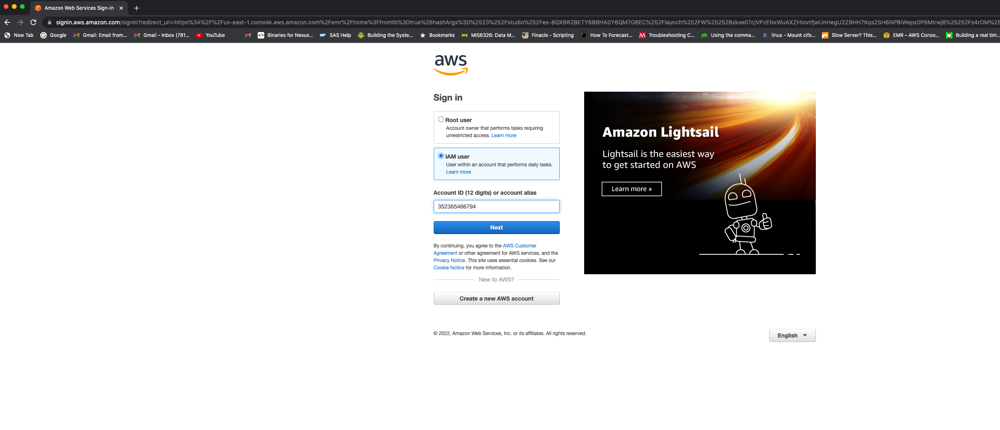
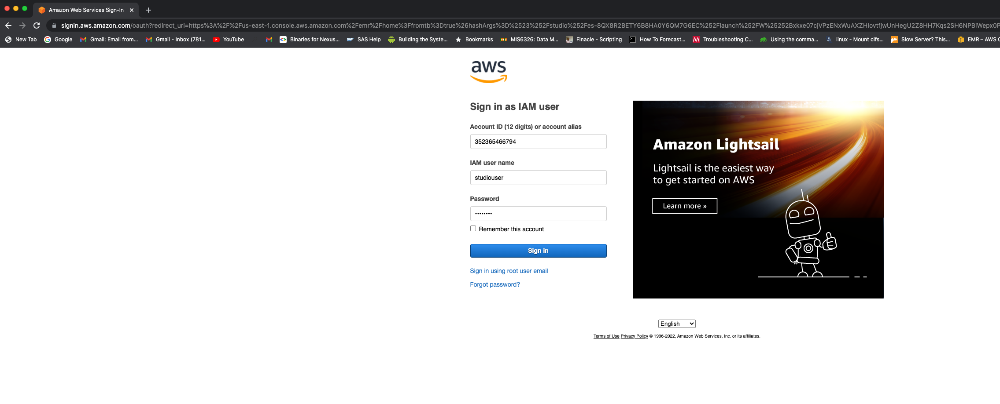
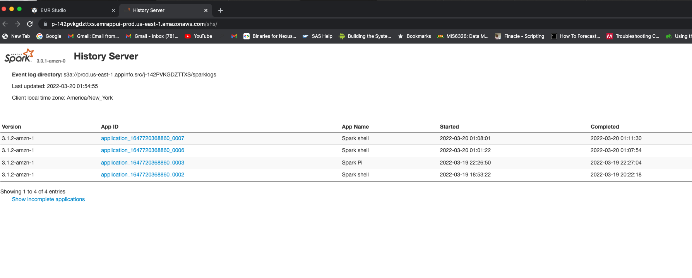
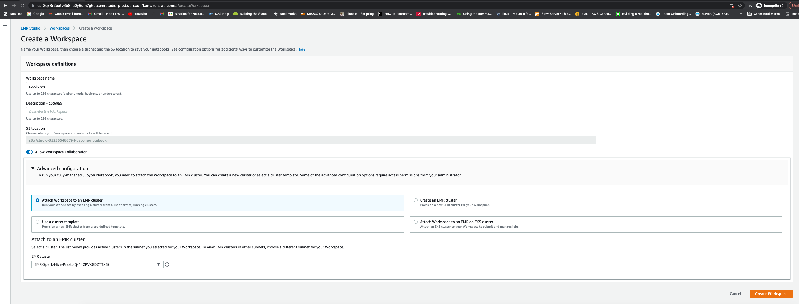

# ** Exercise 3 - Amazon EMR Studio **

### Log in to EMR Studio

In this exercise we will run Spark workflows using EMR Studio with managed Jupyter-based notebooks.

Go to the EMR Web Console and navigate to "EMR Studio" on the right hand side. Click on "Get Started".

You will be able to see an EMR Studio created called "workshop-studio". Click on it and in the following page, copy the Studio URL.

Open an incognito or a private browser and paste the URL. In the AWS login page, choose "IAM User" and enter the account ID retrieved from your event engine's AWS Web console. Click on Next.

Under IAM user name, enter  "studiouser". Under password, enter Test123$. Click on Sign in.

You will be logged into the EMR Studio. Users can access this interface without requiring AWS Web Console access. EMR Studio supports both IAM and SSO auth modes.

### Check EMR clusters from EMR Studio

Check the clusters under EMR on EC2. You can filter the clusters. Click on "EMR-Spark-Hive-Presto" and go to "Launch application UI -> Spark History Server".

You will be taken to the EMR Persistent Spark History Server. You can also see the UIs of terminated clusters for up to 60 days after termination.

### Create a Studio Workspace

Go to Workspaces and "Create Workspace".

Enter a workspace name. For example: "studio-ws". Enable "Allow Workspace Collaboration". Under "Advanced Configuration", select "Attach Workspace to an EMR cluster". In the drop down, choose the EMR-Spark-Hive-Presto cluster. Click "Create Workspace".

It will take about 2 minutes for the Status to change to "Attached".  

Click on the workspace and it will open a managed JupyterLab session. You will be 
